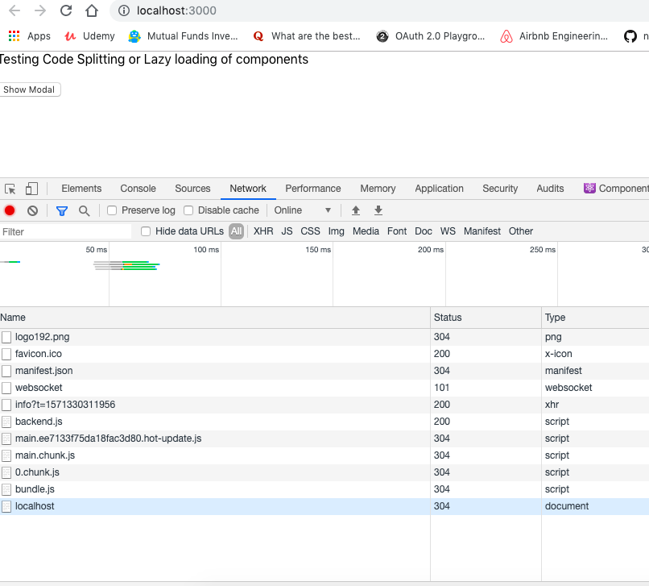
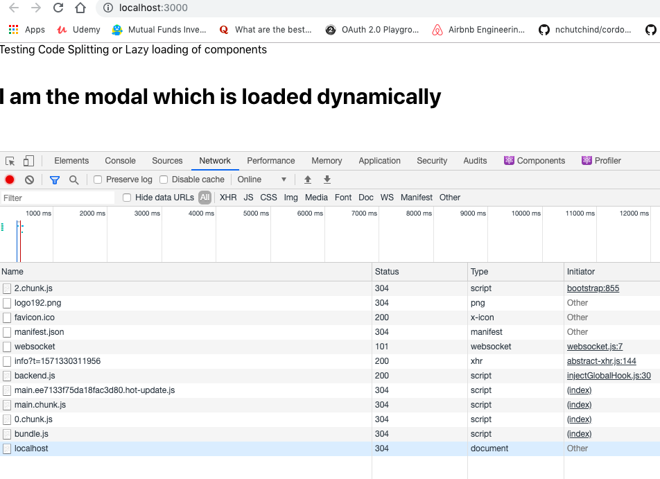

## Code Splitting Components with React

This project is built to help understand how to code split child components to optimize performance in React Web apps with create-react-app

### Project Description:
 * App Component
    In this page there is a button and a modal. On Click of the button the modal should be shown. The logic is to not to render the modal.js until the button is clicked

* Modal Component
    Displays the modal component

### Getting Started
To get you started you can simply clone the repository:

```
git clone https://github.com/Rajdeepc/react-code-split-component.git
```

### Prerequisites
You need git to clone the repository. You can get git from
[http://git-scm.com/](http://git-scm.com/).

A number of node.js tools is necessary to initialize and test the project. You must have node.js and its package manager (npm) installed. You can get them from  [http://nodejs.org/](http://nodejs.org/).

### Installing

and install the dependencies
```
npm install
```

#### Lint & Build

```sh
npm run lint
npm run build
```

### Run in Local

To Run Locally Steps to follow:

```
npm start

```
### Built With

* [React js](https://github.com/facebook/react/)


## Contributing

### Create a branch

1. `git checkout master` from any folder in your local `https://github.com/Rajdeepc/react-code-split-component.git` repository
1. `git pull origin master` to ensure you have the latest main code
1. `git checkout -b the-name-of-my-branch` (replacing `the-name-of-my-branch` with a suitable name) to create a branch

### Make the change

1. Follow the "Running locally" instructions
1. Save the files and check in the browser
  1. Changes to React components in `src` will hot-reload
  1. Changes to markdown files in `content` will hot-reload
  1. If working with plugins, you may need to remove the `.cache` directory and restart the server


### Push it

1. `git add -A && git commit -m "My message"` (replacing `My message` with a commit message, such as `Fixed header logo`) to stage and commit your changes
1. `git push my-fork-name the-name-of-my-branch`
1. Go to the [react-code-split-component](https://github.com/Rajdeepc/react-code-split-component.git) and you should see recently pushed branches.
1. Follow GitHub's instructions.
1. If possible, include screenshots of visual changes. A Netlify build will also be automatically created once you make your PR so other people can see your change.

### Compare Page:

## App Component which doesn't render the Modal Component on Load


## Modal Component which loads once user clicks on the button

